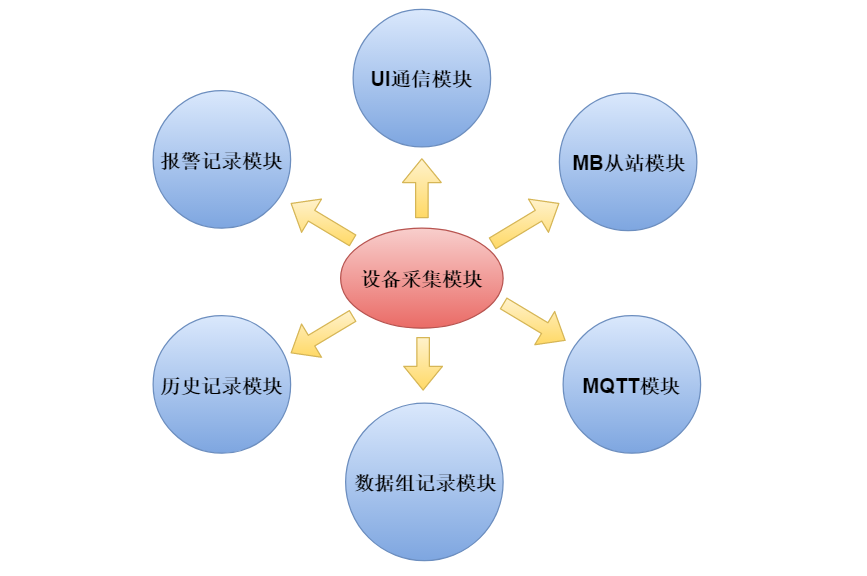

# 一、 前言

&nbsp;&nbsp;&nbsp;&nbsp; 对于设备采集模块，核心管理对象是`变量`；一旦设备采集模块检测到变量变更，就需要主动通知相关模块；相关模块根据变量变更，执行对应业务处理； 
本次开发涉及主要模块：**设备采集模块**、**报警记录模块**、**历史记录模块**、**数据组记录模块**、**MQTT模块**、**modbus从站模块**及**UI通信模块**等等，这些模块间的主要交互对象 --- **变量**。

