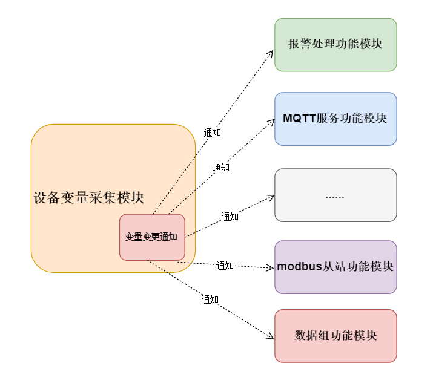
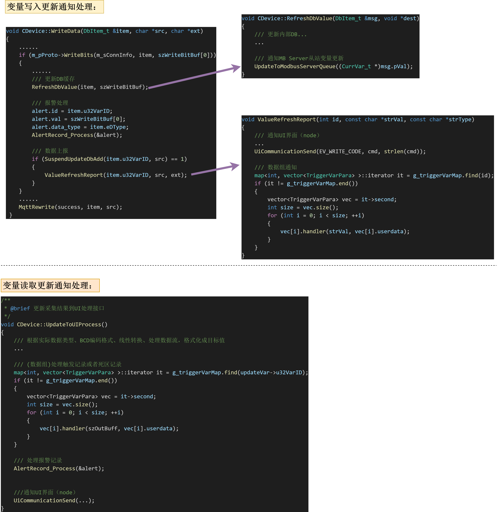

# 二、 目前存在的问题

设备采集模块检测到变量更新后，需要通知相关模块； 
目前这个变量更新事件的通知，是侵入性的；设备采集模块直接耦合了，其他模块接收变量更新的接口代码；

#### 问题点描述：
- 添加新的设备协议，如果变量更新需要重写父类接口，则也需要引入其他模块接收变量更新接口代码
- 添加依赖变量的模块时，需要修改设备采集模块；在其变量更新检测中添加新模块接口代码；
- 需要添加不同的变量更新通知规则时，改动范围较广、影响范围大；  

