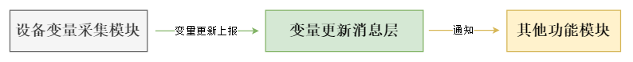

<!-- docs/chapter01/01/install-docsify-cli.md -->

# 三、 优化方案

为变量变更通知，增加一个变量更新消息通知中间层；设备变量采集模块发生变量变更通知事件时，不再直接上报到相关模块，而是上报到消息通知中间层，由消息通知中间层去通知相关模块；

这样，设备采集模块中，不再耦合其他功能模块`接收变量更新消息接口`;当添加依赖于变量的新功能模块时，不再需要改动**设备采集模块**；变量更新上报只依赖于稳定的变量更新消息层，不再受其他功能模插拔影响；