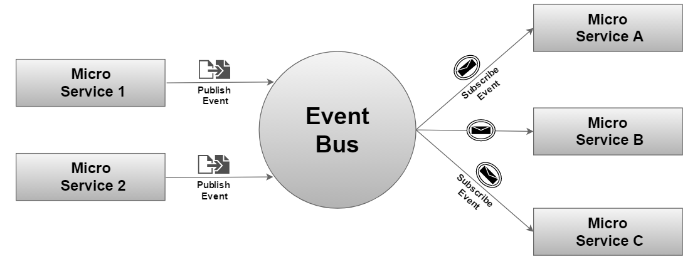

# 5.3 EventBus(事件总线)设计

EventBus是一个观察者模式的实现；借助 EventBus 我们可以很好的实现组件之间，服务之间，系统之间的解耦以及相互通信的问题。

他有如下三个要素：
 - **Event：** 事件；
 - **Publisher:** 事件发布者，用于通知Subscriber有事件发生；
 - **Subscriber：** 事件订阅者，接收特定的事件；
 

#### 5.3.1 定义变量更新事件（Event事件）
变量更新事件：
```clike
class VarUpdateEvent : public Event
{
public:
	VarUpdateEvent(Object & sender, VarUpdate & updater, VarUpdData const & msg) :
	Event(sender),
	VarUpdate(updater),
	msg(msg) {
	}

	virtual ~VarUpdateEvent() { }

	VarUpdate & getupdater() {
		return updater;
	}

	VarUpdData const & getMessage() {
		return msg;
	}

private:
	VarUpdate & updater;
	VarUpdData const & msg;

};
```


#### 5.3.2 触发变量更新事件（Publisher 事件发布者）
变量更新时的通知；
```clike
VarUpdate updater("checkr"); /** VarUpdate instance with a name*/
VarUpdateEvent e(*this, updater, varUpdData); /** Create the event object */
EventBus::FireEvent(e); /** Fire the event */
```


#### 5.3.3 监听变量更新事件（Subscriber 事件订阅者）

对于需要监听变量事件的模块，只需创建一个监听者，并且注册到事件处理器中即可；步骤如下：

Step1. 创建监听者:
```clike
class Listener : public EventHandler<VarUpdateEvent>
{
public:
  virtual void onEvent(VarUpdateEvent & e) override {
    /** 处理变量更新事件，这里是同步通知，不可处理耗时操作 
    */
    std::cout << "The updater '" << e.getupdater().getName() << "' msg: " << e.getMessage();
  }
};
```

Step2. 注册`Event Handler`：

```clike
/// 创建一个变量更新监听事件，并注册到Event Bus中 
Listener pListener;
HandlerRegistration* reg = EventBus::AddHandler<VarUpdateEvent>(pListener);
```
