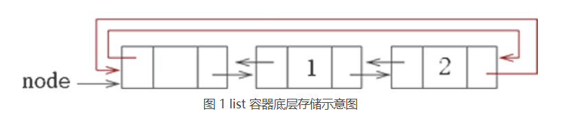

# 5.1 MQ(消息队列)设计

MQ(消息队列)是设备采集模块和变量更新消息模块交互的接口（异步交互）；为采集模块的变量更新，提供统一的通知接口；

其中，MQ无需考虑随机存取，主要考虑快速插入、删除的场景；因此，其内部使用STL中的list来实现，需同时处理线程安全问题；
消息队列传递的数据为`VarUpdData`数据单元。

#### 5.1.1 主要接口说明
##### 5.1.1.0 添加一条变量更新消息
相应模块变量更新时，都调用该接口进行数据上报；例如设备采集模块检测到外部PLC变量变更时，调用该接口进行通知。

**函数原型**
> int OptVarUpdMQ().Push(VarUpdData& data)

**参数说明**

|  参数名   | 说明  |
|  ----  | ----  |
| data  | 变量更新数据 |
| 返回值  | 成功返回 0 |

 

##### 5.1.1.1 拷贝变量更新消息

为了提高MQ（消息队列）的吞吐率，在MQ消息的处理端，需要一次性读出所有消息；消息读出后MQ将自动清零；

**函数原型**
> int OptVarUpdMQ().Move(list<VarUpdData>& listData)

**参数说明**

|  参数名   | 说明  |
|  ----  | ----  |
| listData  | 输出，MQ消息 |
| 返回值  | 成功返回 0 |

 

